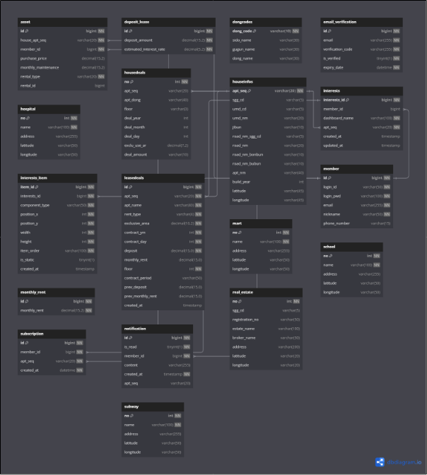

# ZIPDDORI

## 📖 프로젝트 소개
집또리는 부동산 구매 또는 매도를 고려하는 투자자를 위한 맞춤형 서비스입니다. 실시간으로 집값 변동 정보를 제공하는 기본 기능에 더해, 사용자가 보다 깊이 있는 정보를 바탕으로 더 나은 의사 결정을 할 수 있도록 추가적인 기능들을 고도화합니다.

### 주요 기능

- 회원가입/로그인/비밀번호 찾기
- 아파트 매매/전월세 실거래 정보 조회
- AI 매물 비교
- 부동산 관련 최신 뉴스 제공
- 실시간 실거래 발생 알림
- 관심 매물 관리 대시보드
- 부동산 자산 관리 대시보드

## 🛠 기술 스택
### Backend

- Java 17
- Spring Boot 3.3.5
- Spring Data JPA
- MyBatis3

### Frontend
 
- HTML5
- CSS3
- Vue.js

### Database

- MySQL 8.4.31

### Infra

- Apache Airflow
- AWS RDS
- Docker

## 📦 시스템 아키텍처

### 🔍 ERD


## 🚀 설치 및 실행방법
### 요구사항

- Java 17 이상
- MySQL 8.0 이상
- Docker

### 설치방법
```
# 레포지토리 클론
git clone https://github.com/username/project-name.git

# 프로젝트 디렉토리로 이동
cd project-name

# 의존성 설치
./gradlew build

# 애플리케이션 실행
./gradlew bootRun
```


## 📱 화면 구성
페이지설명메인 페이지주요 기능 소개로그인사용자 인증회원가입새로운 계정 생성

## 👥 팀원 소개
이름역할GitHub홍길동Backend@github

## 📜 라이센스
이 프로젝트는 MIT 라이센스로 배포됩니다. 자세한 내용은 LICENSE 파일을 참고해주세요.

## 📞 연락처
프로젝트에 대한 문의나 피드백은 아래 연락처로 부탁드립니다:

Email: ms9648@naver.com
Issue: GitHub Issues를 통해 버그를 보고하거나 기능을 요청할 수 있습니다.
